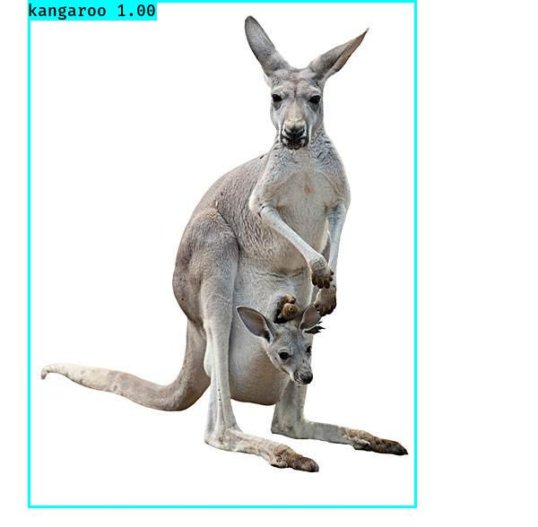
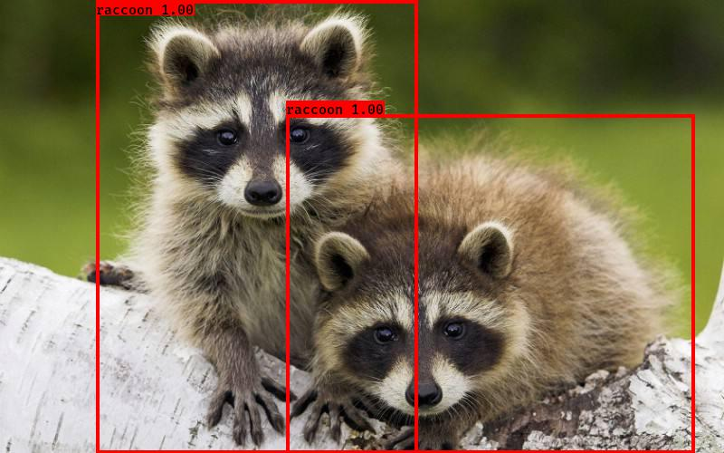

#yolo3-v3-keras

[](LICENSE)

## Introduction

A Keras implementation of YOLOv3 (Tensorflow backend) forked by [qqwweee](https://github.com/qqwweee/keras-yolo3).


---

## Quick Start

1. Download YOLOv3 weights from [YOLO website](http://pjreddie.com/darknet/yolo/).
2. Convert the Darknet YOLO model to a Keras model.
3. Run YOLO detection.

```
wget https://pjreddie.com/media/files/yolov3.weights
python convert.py yolov3.cfg yolov3.weights model_data/yolo_weights.h5
python yolo_image.py  for image detection mode
python yolo_video.py [video_path] [output_path (optional)]
```

For Tiny YOLOv3, just do in a similar way, just specify model path and anchor path with `--model model_file` and `--anchors anchor_file`.

### Usage
Use --help to see usage of yolo_video.py:
```
usage: yolo_video.py [-h] [--model MODEL] [--anchors ANCHORS]
                     [--classes CLASSES] [--gpu_num GPU_NUM] [--image]
                     [--input] [--output]

positional arguments:
  --input        Video input path
  --output       Video output path

optional arguments:
  -h, --help         show this help message and exit
  --model MODEL      path to model weight file, default model_data/yolo.h5
  --anchors ANCHORS  path to anchor definitions, default
                     model_data/yolo_anchors.txt
  --classes CLASSES  path to class definitions, default
                     model_data/coco_classes.txt
  --gpu_num GPU_NUM  Number of GPU to use, default 1
  --image            Image detection mode, will ignore all positional arguments
```
---

4. MultiGPU usage: use `--gpu_num N` to use N GPUs. It is passed to the [Keras multi_gpu_model()](https://keras.io/utils/#multi_gpu_model).

## Training for your data
1. Use labelImg tools[labelImg](https://github.com/tzutalin/labelImg) to label image and generate your own annotation file.

2. Convert annotation file to text file, format is as follows:

3. Generate your own annotation file and class names file.  
    One row for one image;  
    Row format: `image_file_path box1 box2 ... boxN`;  
    Box format: `x_min,y_min,x_max,y_max,class_id` (no space).  
    Here is an example:
    ```
    path/to/img1.jpg 50,100,150,200,0 30,50,200,120,3
    path/to/img2.jpg 120,300,250,600,2
    ...
    ```
    There is a written program automatically generated here.
    python my_voc_annotation.py  

4. Refer to voc classes to modify your own classes.
    Here is an example in my_voc_classes.txt:
        kangaroo
        raccoon

5. Modify train.py and start training.  
    `python my_train.py`  
    Use your trained weights or checkpoint weights with command line option `--model model_file` when using yolo_video.py
    Remember to modify class path or anchor path, with `--classes class_file` and `--anchors anchor_file`.

---
## Testing
    python yolo_image.py  for image detection mode.
    python yolo_video.py [video_path] [output_path (optional)].

---

## Result
.

.

## Some issues to know

1. The test environment is
    - Python 3.5.2
    - Keras 2.1.5
    - tensorflow 1.6.0

2. Default anchors are used. If you use your own anchors, probably some changes are needed.

3. The inference result is not totally the same as Darknet but the difference is small.

4. The speed is slower than Darknet. Replacing PIL with opencv may help a little.

5. Always load pretrained weights and freeze layers in the first stage of training. Or try Darknet training. It's OK if there is a mismatch warning.

6. The training strategy is for reference only. Adjust it according to your dataset and your goal. And add further strategy if needed.

7. For speeding up the training process with frozen layers train_bottleneck.py can be used. It will compute the bottleneck features of the frozen model first and then only trains the last layers. This makes training on CPU possible in a reasonable time. See [this](https://blog.keras.io/building-powerful-image-classification-models-using-very-little-data.html) for more information on bottleneck features.
